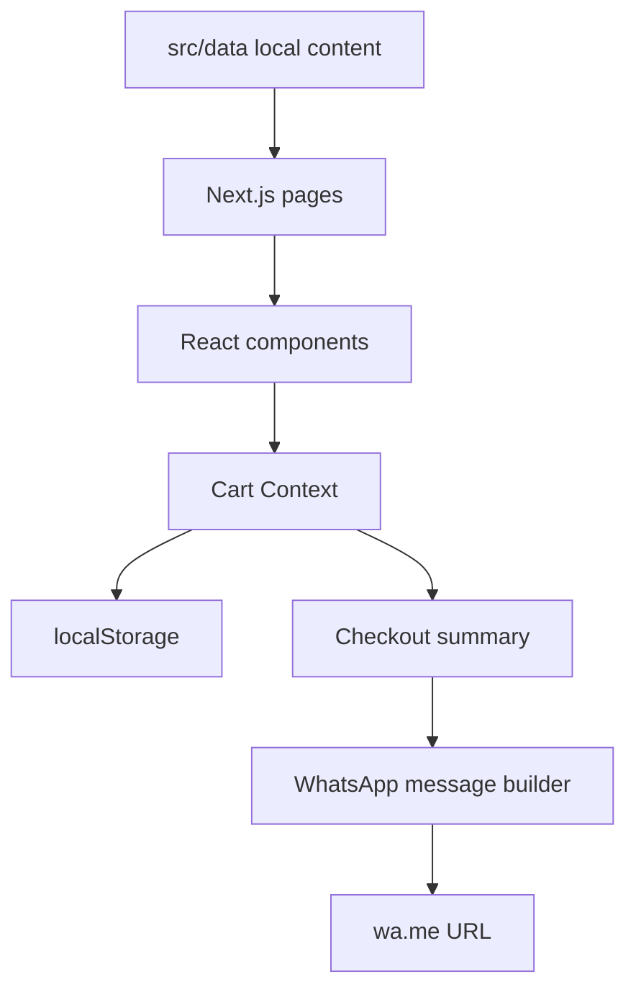
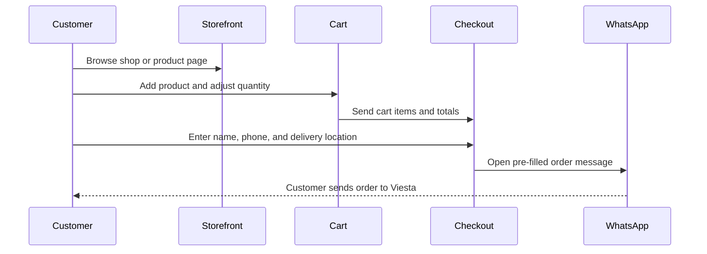

# Viesta Nutrition

Static e-commerce storefront for Viesta Nutrition, a Kenyan nutrition and health supplements shop. The site helps customers browse products, review a cart, enter delivery details, and send a structured order through WhatsApp.


## Project Status

Proprietary pre-launch storefront.

The application structure and commerce flow are implemented, but production launch still depends on final business confirmation for:

- Product labels, ingredients, usage directions, warnings, and compliant health claims.
- M-Pesa Paybill/Till details.
- Final legal copy.
- Responsive, browser, accessibility, and WhatsApp redirect testing.

## Tech Stack

| Area | Technology | Purpose |
|---|---|---|
| Framework | Next.js App Router | Static-friendly routing, layouts, metadata, and page rendering |
| Language | TypeScript | Typed application code and typed local content |
| UI | React | Component model and client-side interactions |
| Styling | Tailwind CSS, global CSS tokens | Utility styling plus shared brand/theme primitives |
| State | React Context | Cart and toast state |
| Persistence | `localStorage` | Browser-side cart persistence |
| Validation | Zod, local validation helpers | Checkout and domain validation |
| Icons | Lucide React, custom WhatsApp icon | Interface and commerce action icons |
| Testing | Vitest, Testing Library | Unit tests for helpers and key behavior |
| Quality | ESLint, TypeScript, Prettier | Linting, type checks, and formatting |
| Deployment target | Vercel/static-friendly Next.js | Production hosting target |

## Quick Start

```bash
npm install
npm run dev
```

Open the local app:

```text
http://localhost:3000
```

### Refresh the local Next.js cache

If a changed static asset, such as a product image, does not appear locally, stop the development server and run:

```bash
rm -rf .next
npm run dev
```

This removes generated Next.js development cache files only; it does not remove source files.

Build and run production locally:

```bash
npm run build
npm start
```

## Prerequisites

- Node.js `20.19+`, or a compatible newer runtime supported by the installed Next.js toolchain.
- npm, using the committed `package-lock.json`.
- No database.
- No authentication provider.
- No required environment variables at the moment.

## How The App Works

Viesta is intentionally simple: product, content, shipping, payment display text, and site metadata are all stored as typed local files. Checkout does not process online payments. It prepares a customer order message and opens WhatsApp with the message pre-filled.



## Folder Structure

```text
.
├── architecture/
│   ├── Architecture.md          # Implementation structure and launch notes
│   ├── Viesta_PRD.md            # Product requirements
│   ├── Viesta_Design_PRD.md     # Visual and interaction direction
│   ├── Viesta_SEO.md            # SEO plan and content guidance
│   └── Viesta_Inventory.md      # Inventory/product planning notes
├── public/
│   ├── favicon.ico
│   └── images/
│       └── products/            # Product images used by the local catalog
├── src/
│   ├── app/                     # App Router routes, layouts, pages, global CSS
│   ├── components/              # UI, layout, shop, product, cart, checkout, content
│   ├── context/                 # CartProvider and ToastProvider
│   ├── data/                    # Local product, site, shipping, legal, blog, FAQ data
│   ├── hooks/                   # Shared React hooks
│   ├── lib/                     # Cart, pricing, shipping, validation, WhatsApp helpers
│   ├── types/                   # Shared domain types
│   └── __tests__/               # Unit tests
├── eslint.config.mjs            # ESLint configuration
├── next.config.mjs              # Next.js configuration
├── package.json                 # Scripts and dependencies
├── tailwind.config.ts           # Tailwind theme and content paths
├── tsconfig.json                # TypeScript configuration
└── vitest.config.ts             # Vitest configuration
```

## Route Map

```text
/                         Storefront homepage
/shop                     Product discovery, search, filtering, and sorting
/products/[slug]          Product detail pages generated from local product data
/cart                     Full cart review
/checkout                 Checkout form and WhatsApp order handoff
/blog                     Educational content listing
/blog/[slug]              Blog detail pages generated from local blog data
/about                    Brand/about page
/contact                  Contact and WhatsApp inquiry page
/faqs                     Frequently asked questions
/privacy-policy           Draft privacy policy content
/returns-refund-policy    Draft returns and refund content
/terms-of-service         Draft terms content
```

## Data Ownership

| Data | File |
|---|---|
| Site identity, contact details, payment display text, SEO defaults | `src/data/site.ts` |
| Product catalog, prices, variants, claims, confirmation flags | `src/data/products.ts` |
| Product categories | `src/data/categories.ts` |
| Shipping zones and fees | `src/data/shipping-zones.ts` |
| Blog posts | `src/data/blog-posts.ts` |
| FAQs | `src/data/faqs.ts` |
| Legal page content | `src/data/legal.ts` |
| Testimonials | `src/data/testimonials.ts` |

Product claims, legal copy, and payment details should stay visibly marked as pending until the business confirms them. All catalog product prices are confirmed in `src/data/products.ts`.

## Commerce Flow



Shipping rules are currently:

| Location | Fee |
|---|---:|
| Nairobi | Free |
| Kiambu | Free |
| Mombasa | KES 500 |
| Kisumu | KES 500 |
| Nakuru | KES 500 |
| Eldoret | KES 500 |
| Other / rest of Kenya | Confirmed on WhatsApp |

## Common Development Tasks

Update products:

```text
src/data/products.ts
public/images/products/
```

Update business contact, currency, SEO defaults, or payment display text:

```text
src/data/site.ts
```

Update delivery fees:

```text
src/data/shipping-zones.ts
src/lib/shipping.ts
src/__tests__/shipping.test.ts
```

Update checkout validation:

```text
src/lib/validation.ts
src/__tests__/validation.test.ts
```

Update WhatsApp order text or URL behavior:

```text
src/lib/whatsapp.ts
src/__tests__/whatsapp.test.ts
```

Update page layouts or route-level content:

```text
src/app/
src/components/
```

## Scripts

| Command | Purpose |
|---|---|
| `npm run dev` | Start the local development server |
| `npm run build` | Create a production build |
| `npm start` | Start the production server after building |
| `npm run lint` | Run ESLint |
| `npm run type-check` | Run TypeScript without emitting files |
| `npm test` | Run unit tests once |
| `npm run test:watch` | Run unit tests in watch mode |
| `npm run format:check` | Check Prettier formatting |
| `npm run format` | Format files with Prettier |

Recommended verification before merging application changes:

```bash
npm run type-check
npm run lint
npm test
npm run build
```

## Testing

Current tests cover:

- Cart helper behavior.
- Product pricing helpers.
- KES currency formatting.
- Shipping fee calculation.
- Checkout validation.
- WhatsApp message and URL generation.
- Product data expectations.

The tests live in:

```text
src/__tests__/
```

## Architecture Documentation

The full architecture source of truth is:

```text
architecture/Architecture.md
```

Use the root README for onboarding and daily development. Use the architecture document for implementation structure, client/server boundaries, commerce behavior, and launch blockers.

## Deployment

The app targets Vercel or another static-friendly Next.js hosting environment.

Before production deployment:

- Confirm Paybill/Till details.
- Review health and product claims for compliance.
- Finalize legal pages.
- Verify WhatsApp ordering on mobile devices.
- Run the full quality command set.

## License

Proprietary and confidential. No license is granted to use, copy, modify, distribute, or sublicense this project without written permission from the owner.
